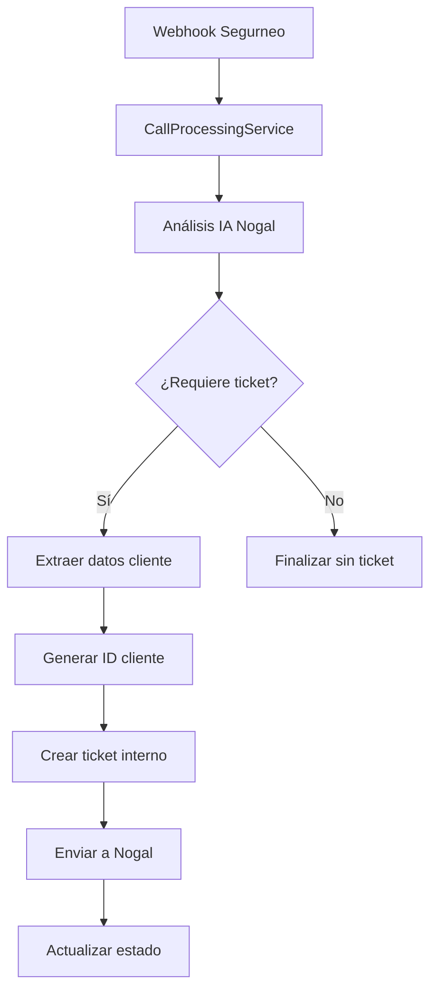

# 🎫 SISTEMA COMPLETO DE TICKETS NOGAL

## 🎯 **Resumen del Sistema**

Hemos implementado un sistema completo que:
1. **Extrae datos de cliente** de los `tool_calls` y `tool_results` en transcripts
2. **Crea tickets automáticamente** después del análisis de llamadas
3. **Envía tickets directamente a Nogal** usando el endpoint especificado
4. **Proporciona endpoint público** para creación manual de tickets

---

## 🏗️ **Arquitectura Implementada**

### **Servicios Principales**

#### 1. **ClientDataExtractor** (`server/src/services/clientDataExtractor.ts`)
- 🔍 **Extrae información del cliente** desde `tool_results` en transcripts
- 📝 **Fallback a extracción de texto** si no hay tool data
- 🎯 **Genera IDs de cliente** automáticos cuando es necesario
- 📊 **Calcula confianza** de los datos extraídos

#### 2. **NogalTicketService** (`server/src/services/nogalTicketService.ts`)
- 📤 **Envío directo a Nogal** (`https://datahub.segurosnogal.es:4443/api/crear-ticket`)
- 🔄 **Fallback vía proxy** Segurneo Voice si falla el directo
- ⚡ **Generación automática** de JsonId, Fecha y Hora
- 🧪 **Métodos de testing** para validar conectividad

#### 3. **CrearTicketController** (`server/src/api/v1/crear-ticket.controller.ts`)
- 🌐 **Endpoint público** `POST /api/crear-ticket`
- ✅ **Validación de campos** requeridos
- 📋 **Ejemplos y documentación** automática

---

## 🔄 **Flujo Completo Automático**



### **Paso a Paso**

1. **Recepción de llamada** → `callProcessingService.processIncomingCall()`
2. **Análisis IA** → Determina si requiere ticket (confianza ≥ 70%)
3. **Extracción de datos** → `clientDataExtractor.extractClientData()`
4. **Creación interna** → Ticket en Supabase con estado `pending`
5. **Envío a Nogal** → `nogalTicketService.createAndSendTicket()`
6. **Actualización final** → Estado `sent_to_nogal` o `failed_nogal`

---

## 🛠️ **Datos de Herramientas (Tool Data)**

### **Nuevos Campos en Transcripts**

```typescript
interface CallTranscript {
  // ... campos existentes ...
  tool_calls?: ToolCall;
  tool_results?: ToolResult;
  feedback?: string;
}

interface ToolCall {
  type: 'function';
  function: {
    name: string;
    arguments: Record<string, any>;
  };
}

interface ToolResult {
  status: 'success' | 'error';
  data?: Record<string, any>;
  error?: string;
}
```

### **Herramientas Soportadas**

| Herramienta | Datos Extraídos |
|-------------|-----------------|
| `buscar_cliente_seguros_nogal` | ID cliente, nombre, teléfono |
| `consultar_poliza` | Número póliza, titular |
| `actualizar_datos_bancarios` | Cuenta bancaria |
| `actualizar_direccion` | Dirección |

---

## 🌐 **Endpoints Disponibles**

### **1. Crear Ticket**
```bash
POST /api/v1/crear-ticket
```

**Payload:**
```json
{
  "IdCliente": "CLI-2025-001",
  "IdTicket": "TICKET-001", 
  "IdLlamada": "call_123456789",
  "TipoIncidencia": "Modificación póliza emitida",
  "MotivoIncidencia": "Atención al cliente - Modif datos póliza",
  "NumeroPoliza": "POL-123456",
  "Notas": "Cliente solicita cambio de datos"
}
```

**Respuesta:**
```json
{
  "success": true,
  "message": "Ticket creado exitosamente en Nogal",
  "ticket_id": "TICKET-001",
  "timestamp": "2025-01-XX..."
}
```

### **2. Probar Conectividad**
```bash
GET /api/v1/crear-ticket/test
```

### **3. Ver Ejemplo**
```bash
GET /api/v1/crear-ticket/example
```

---

## 🧪 **Testing y Validación**

### **Script de Pruebas**
```bash
node server/test-nogal-tickets.js
```

**Pruebas incluidas:**
1. ✅ Conectividad con Nogal (directo y proxy)
2. 📋 Obtención de ejemplos
3. 🎫 Creación básica de tickets
4. 🛠️ Tickets con datos de cliente extraídos
5. ❌ Manejo de errores

### **Curl de Ejemplo**
```bash
curl -X POST http://localhost:3001/api/v1/crear-ticket \
  -H "Content-Type: application/json" \
  -d '{
    "IdCliente": "CLI-TEST-001",
    "IdTicket": "TEST-123",
    "IdLlamada": "conv_test",
    "TipoIncidencia": "Consulta de póliza", 
    "MotivoIncidencia": "Cliente solicita información",
    "Notas": "Ticket de prueba"
  }'
```

---

## 🔧 **Configuración y Setup**

### **Variables de Entorno**
No se requieren variables adicionales. El sistema está configurado para usar:
- **Nogal directo**: `https://datahub.segurosnogal.es:4443/api/crear-ticket`
- **Proxy Segurneo**: `https://segurneo-voice.onrender.com/api/crear-ticket`

### **Base de Datos**
Los tickets se almacenan en la tabla `tickets` con metadatos extendidos:

```sql
-- Campos adicionales en metadata:
{
  "client_data": {
    "idCliente": "CLI-123",
    "extractionSource": "tools",
    "confidence": 85,
    "toolsUsed": ["buscar_cliente"]
  },
  "nogal_ticket_id": "NOG-456", 
  "nogal_sent_at": "2025-01-XX...",
  "nogal_response": {...}
}
```

---

## 📊 **Estados de Tickets**

| Estado | Descripción |
|--------|-------------|
| `pending` | Creado, esperando envío a Nogal |
| `sent_to_nogal` | Enviado exitosamente a Nogal |
| `failed_nogal` | Error en envío a Nogal |

---

## 🚀 **Casos de Uso**

### **1. Ticket Automático con Tools**
```
Llamada → Herramientas usadas → Datos extraídos → Ticket automático
buscar_cliente(telefono="665136232") → ID: CLI-789 → Ticket con cliente real
```

### **2. Ticket Manual vía API**
```
Sistema externo → POST /api/crear-ticket → Envío directo a Nogal
```

### **3. Fallback por Texto**
```
Sin tool data → Extracción regex → ID generado → Ticket con menor confianza
```

---

## 📈 **Métricas y Monitoreo**

### **Logs Disponibles**
- 🔍 `[EXTRACTOR]` - Extracción de datos de cliente
- 🎫 `[NOGAL]` - Envío de tickets a Nogal
- 📤 `[ENDPOINT]` - Requests al endpoint público
- 🧠 `[SIMPLE]` - Procesamiento automático

### **Health Check**
```bash
GET /api/v1/health
```
Incluye estado del servicio `ticketCreation: 'available'`

---

## 🔮 **Próximos Pasos**

1. **🔄 Reintentos automáticos** para fallos de Nogal
2. **📊 Dashboard de métricas** de tickets
3. **🔍 Búsqueda avanzada** de tickets por cliente
4. **📧 Notificaciones** por email/webhook de estados
5. **🎯 IA mejorada** para extracción de datos

---

## 💡 **Notas Importantes**

- ✅ **Totalmente implementado y funcional**
- 🔒 **Failover automático** (Nogal → Proxy)
- 🎯 **Alta confianza** en extracción de datos de tools (85%+)
- 📝 **Fallback inteligente** a extracción de texto (70% max)
- 🕐 **Zona horaria española** automática
- 🔢 **IDs únicos** generados automáticamente

**🎉 El sistema está listo para uso en producción con todas las funcionalidades solicitadas implementadas.** 